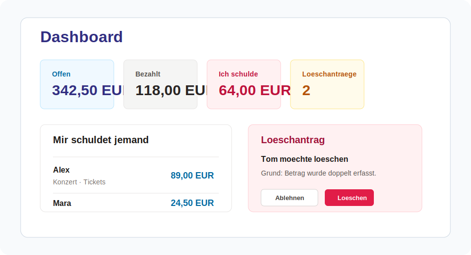
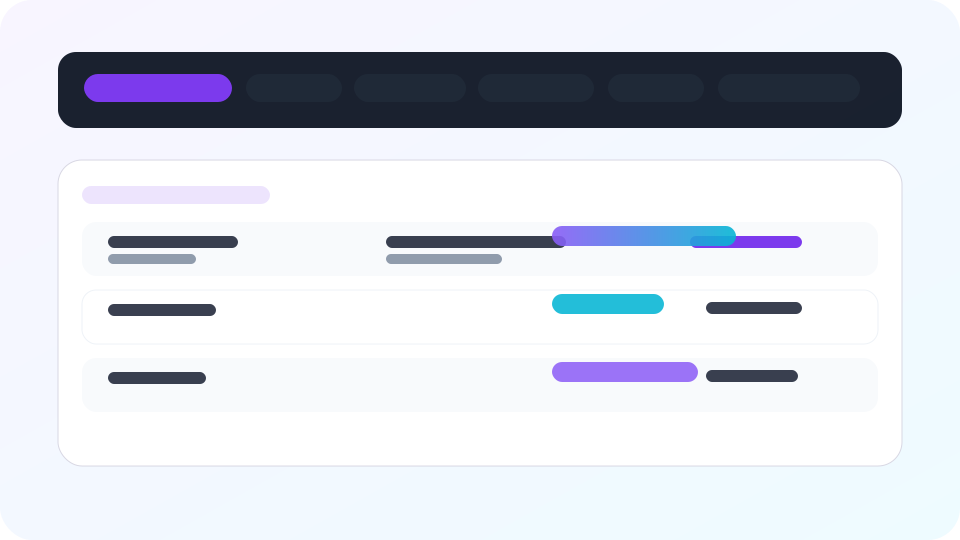
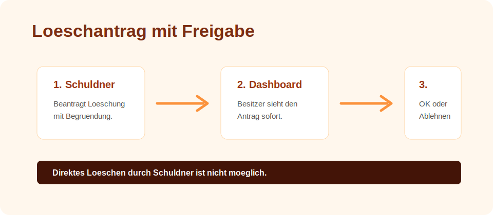
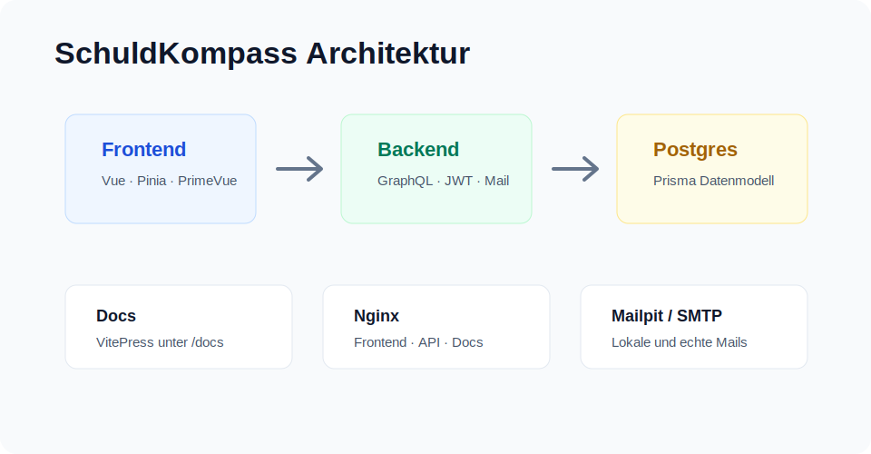

<p align="center">
  
</p>

<h1 align="center">SchuldKompass</h1>

SchuldKompass ist eine Full-Stack-App zum Erfassen, Nachverfolgen und Klaeren privater Schulden. Besitzer tragen ein, wer ihnen Geld schuldet. Schuldner melden sich mit ihrer E-Mail-Adresse an und sehen offene sowie bereits bezahlte Eintraege. Bezahlt wird nicht direkt, sondern per Zahlungsantrag mit Bemerkung und anschliessender Bestaetigung durch den Besitzer.





## Highlights

- Vue 3 Frontend mit TypeScript, Tailwind CSS, PrimeVue, Pinia und Vue Router
- GraphQL Backend mit Apollo Server, Prisma, PostgreSQL und JWT-Auth
- E-Mail-Versand bei Registrierung und neuen Schulden
- Persistente Mail-Retry-Queue mit SMTP-Timeouts und automatischen Wiederholungen
- Prometheus-Metriken und provisioniertes Grafana-Dashboard
- Zentrale Docker-Logs mit Loki, Grafana Alloy und Filtern nach Service und Log-Level
- Bekannte Schuldner und Kategorien als Dropdowns
- Summen pro Schuldner und gruppierte bezahlte Schulden
- Auswertungsseite fuer Kategorien, offene/beglichene Betraege und Schuldner pro Kategorie
- Tabbasierte Schuldenansicht und tabbasierte Auswertung nach Schuldner und Kategorie
- Hilfe-Seite mit Kurzanleitung, aktueller Version und Versionsverlauf
- Versionstabelle im Backend, die ueber Migrationen erweitert wird
- Loeschantraege mit Begruendung und Freigabe durch den Besitzer
- Zahlungsantraege mit Pflicht-Bemerkung und Bestaetigung durch den Besitzer
- Leere Bereiche werden ausgeblendet und durch klare Empty States ersetzt
- Trendige 2026-Farbwelt mit chromatischen Neutrals, Violet/Cyan-Akzenten und geprueftem Dark Mode
- Mobile optimierte Kartenansichten fuer Schuldenlisten
- VitePress Dokumentation unter `/docs`
- Production-Docker-Setup mit separaten Nginx-Containern und Edge-Nginx
- Oxlint und Oxfmt fuer schnelle Codequalitaet und Formatierung

## Ablauf



Schuldner koennen Schulden nicht direkt loeschen. Sie beantragen die Loeschung mit Begruendung. Der Besitzer sieht offene Antraege im Dashboard und in den passenden Tabellen. Gibt es keine offenen Antraege, werden die Bereiche und Spalten ausgeblendet.

## Architektur



```text
frontend/  Vue App mit PrimeVue, Tailwind, Pinia und Router
backend/   Apollo GraphQL API, Prisma, JWT und Mailversand
docs/      VitePress Anleitung
docker/    Nginx-Konfigurationen fuer Production
```

## Setup

```bash
npm install
cp backend/.env.example backend/.env
npm run db:up
npm run prisma:migrate
npm run dev
```

Frontend: http://localhost:5173

GraphQL: http://localhost:4001/graphql

Lokale Mailbox: http://localhost:8025

Backend-Metriken: http://localhost:9101/metrics

Prometheus: http://localhost:9090

Grafana: http://localhost:3000 (lokal: `admin` / `admin`)

Dokumentation:

```bash
npm run dev:docs
```

## Qualitaet

```bash
npm run format
npm run format:check
npm run lint
npm run typecheck
npm run build
npm run build:docs
```

## E-Mail

In der lokalen Entwicklung verschickt das Backend E-Mails an Mailpit ueber `SMTP_HOST=localhost` und `SMTP_PORT=1025`.

Fuer echte E-Mails traegst du in `backend/.env` deine SMTP-Daten ein:

```bash
MAIL_FROM="SchuldKompass <deine-mail@example.com>"
SMTP_HOST="smtp.example.com"
SMTP_PORT=587
SMTP_SECURE=false
SMTP_USER="dein-user"
SMTP_PASS="dein-passwort"
SMTP_CONNECTION_TIMEOUT_MS=10000
SMTP_GREETING_TIMEOUT_MS=10000
SMTP_SOCKET_TIMEOUT_MS=15000
MAIL_RETRY_ENABLED=true
MAIL_RETRY_INTERVAL_MINUTES=5
MAIL_RETRY_MAX_ATTEMPTS=10
MAIL_RETRY_BATCH_SIZE=20
```

Wenn ein SMTP-Versand fehlschlaegt, legt das Backend die Mail in `QueuedMail` ab und versucht sie im konfigurierten Intervall erneut. So gehen Mails bei SMTP-Time-outs oder temporaeren Limits nicht verloren.

## Monitoring

Das Backend stellt Prometheus-Metriken auf `/metrics` am `METRICS_PORT` bereit. Lokal startet `docker compose up -d prometheus grafana` den gesamten Monitoring-Stack aus Prometheus, Loki, Grafana und Alloy. Alloy sammelt die Logs aller Docker-Container ueber den Docker-Socket und sendet sie an Loki. Die Aufbewahrungszeit betraegt sieben Tage. Das Dashboard `SchuldKompass Backend` wird automatisch provisioniert und filtert Logs nach Docker-Service, Log-Level und Freitext.

Wichtige Metriken:

- `schuldkompass_graphql_requests_total`
- `schuldkompass_graphql_errors_total`
- `schuldkompass_graphql_request_duration_seconds`
- `schuldkompass_mail_events_total`
- `schuldkompass_queued_mails`

Das Dashboard enthaelt ausserdem Docker-Log-Volumen, Fehler aus den strukturierten Backend-Logs und eine durchsuchbare Log-Ansicht mit Service-Filter.

In Production startet das Monitoring-Profil Prometheus und Grafana:

```bash
docker compose -f docker-compose.prod.yml --profile monitoring up -d prometheus grafana
```

## Production Docker

Das Production-Setup liegt in `docker-compose.prod.yml`.

```bash
npm run docker:prod:build
npm run docker:prod:up
```

Routing ueber den Edge-Nginx:

- Frontend: `http://localhost/`
- Docs: `http://localhost/docs/`
- GraphQL: `http://localhost/graphql`
- HTTPS: `https://localhost/` mit selbstsigniertem Fallback-Zertifikat

Wenn Docker rootless laeuft und keine Ports unter `1024` binden darf, nutze lokal:

```bash
npm run docker:prod:up:local
```

Dann gilt:

- Frontend: `http://localhost:8080/`
- Docs: `http://localhost:8080/docs/`
- GraphQL: `http://localhost:8080/graphql`
- HTTPS: `https://localhost:8443/`

Fuer echte TLS-Zertifikate kannst du den Edge-Nginx spaeter mit eigenen Zertifikaten unter `/etc/nginx/certs/fullchain.pem` und `/etc/nginx/certs/privkey.pem` betreiben.

## Changelog

Alle relevanten Aenderungen stehen in [CHANGELOG.md](CHANGELOG.md).
